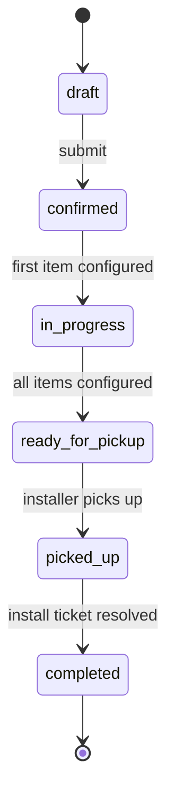

# Vitalock — Flow Documentation

End-to-end journey documentation for the main business flows of Vitalock.
Complementary to `openspec/specs/` — those hold **domain contracts** (per
bounded context); the docs in this folder describe **cross-context journeys**
that a user (admin, installer) or the system (pg_cron, triggers) walks through
from start to finish.

---

## Purpose

Answer three questions for every important flow:

1. **What should happen** — step-by-step, in business terms.
2. **Where it lives in code** — `file:line` references, RPCs, tables, tests.
3. **How to prove it works** — covering tests + a QA checklist.

Optimized for:
- Human QA (manual regression before releases)
- AI agents (Claude Code, sub-agents, future maintainers) — greppable frontmatter, semantic links, atomic files
- Onboarding (a new engineer reads one file to understand one flow)

---

## Directory layout

```
docs/flows/
├── README.md                       ← this file
├── setup/                          ← master data / prerequisites
│   ├── administration-creation.md
│   ├── building-creation.md
│   └── stock-loading.md
├── keys/                           ← RFID key business flows
│   └── order-lifecycle.md
├── technical-service/              ← support.tickets business flows
│   ├── order-lifecycle.md
│   ├── maintenance.md
│   ├── installation.md
│   ├── key-configuration.md
│   ├── key-installation.md
│   ├── equipment-installation.md
│   ├── equipment-replacement.md
│   └── equipment-update.md
└── cross-cutting/                  ← concerns that span multiple flows
    ├── stock-reservation.md
    ├── active-key-transfer.md
    ├── order-numbering.md
    ├── recompute-status.md
    ├── rls-boundaries.md
    ├── realtime-channels.md
    └── billing-transitions.md
```

---

## File template

Every flow file MUST follow this exact structure. Copy it verbatim when
adding a new flow.

```markdown
---
name: <kebab-case-slug>                # must match filename (without .md)
title: <Human-Readable Title>
kind: journey                          # journey | cross-cutting
actors: [admin, installer, system]     # who drives / observes this flow
covers_requirements:                   # OpenSpec requirement IDs this flow exercises
  - key-lifecycle#five-state-key-status-domain
  - tickets#category-immutable
related_rpcs: [configure_key_order_item, resolve_ticket]
related_tables: [key_orders, key_order_items, rfid_keys, stock_movements]
covering_tests:
  pgtap: [test_042_key_order_lifecycle.sql]
  vitest: [KeyOrdersHub.test.tsx, useKeyOrders.test.ts]
last_verified: 2026-08-27               # YYYY-MM-DD — bump when re-checking
---

# <Title>

## Purpose

One paragraph. What business problem does this flow solve? Who cares?

## Actors & preconditions

- **admin** — must have `admin` role
- **installer** — must be assigned via `assigned_to_staff_id`
- **preconditions**: e.g. a building exists, stock has been loaded, ...

## Happy path

Numbered, one line per step. Each step names:
- the UI action (with `file.tsx:line` reference)
- the RPC/mutation triggered
- the resulting DB effect
- what the user sees next

1. Admin opens `/llaves` → clicks **Nueva orden** → `KeyOrdersHub.tsx:42`
2. Admin picks administration + building → submits form → RPC `create_key_order` inserts row in `key_orders` with `status='draft'`
3. ...

## State machine

Diagram in Mermaid. Show every state and every legal transition.



## Cross-cutting effects

What this flow triggers in OTHER parts of the system. Link with `[[wiki-links]]`
to other flow docs.

- **Stock reservation** → creates `stock_movements` rows of type `reserve`
  → see [[stock-reservation]]
- **Ticket creation** → creates `support.tickets` with category `key_configuration`
  → see [[technical-service-order-lifecycle]]
- **Status recompute** → `recompute_key_order_status` fires on item status change
  → see [[recompute-status]]

## Error paths & guards

- **RLS**: installer cannot list orders they are not assigned to
- **CHECK**: `key_orders.status` restricted to enum values
- **Trigger**: `key_order_items.status` cannot go backwards
- **Guard**: cannot cancel an order past `ready_for_pickup` — user sees toast "..."

## QA checklist

Concrete manual steps a human (or Chrome DevTools MCP) can walk through to
verify the flow is alive.

- [ ] Login as admin → `/llaves` → create order → confirm status is `draft` in DB
- [ ] Add 3 items → confirm each creates a `key_configuration` ticket
- [ ] Login as installer → `/` → see the tickets assigned
- [ ] Resolve all tickets → confirm order transitions `in_progress` → `ready_for_pickup`
- [ ] Pick up → confirm status → `picked_up`
- [ ] Install → confirm `completed` and `rfid_keys.status = 'active'`
- [ ] `stock_movements` shows the correct reserve → consume chain

## Related flows

- [[stock-reservation]] — how stock is reserved when this order is created
- [[recompute-status]] — the status transition machinery
- [[billing-transitions]] — how this reaches "ready to invoice"
```

---

## Conventions

### Frontmatter

- `name` MUST match the filename (without `.md`)
- `kind`: `journey` for end-to-end user flows; `cross-cutting` for mechanics
  that other flows depend on (stock, numbering, status recompute…)
- `covers_requirements` MUST use the format `<openspec-spec-name>#<slugified-requirement-heading>`
- `last_verified` MUST be an ISO date — bumped every time the flow is re-checked
  against the code

### Line references

- Always in the format `file/path.tsx:linenum` — one file, one line
- Prefer the entry point over deep internals (a page component, not a leaf hook)
- If the code moves, the line becomes stale — that is intentional. A future CI
  check should flag stale references.

### `[[wiki-links]]`

- Use the `name` slug of the target flow doc
- These are markdown-safe (renders as `[[stock-reservation]]` in most viewers)
  and greppable for cross-reference indexing

### Language

- Domain terms in English (matches DB schema and code)
- Prose in English for consistency with `openspec/` — even though Rioplatense
  is the conversation language, artifacts stay language-neutral so agents and
  external contributors can read them

### When to update

- Whenever a flow's happy path changes materially
- Whenever a covering test is added/removed
- After every SDD change that touches the flow (in the `apply` phase, bump
  `last_verified`)

---

## Discovering the right flow

**By actor**: grep frontmatter `actors:` field
```sh
rg -l "actors:.*installer" docs/flows/
```

**By table touched**: grep `related_tables`
```sh
rg -l "related_tables:.*rfid_keys" docs/flows/
```

**By requirement covered**: grep `covers_requirements`
```sh
rg -l "covers_requirements:.*key-lifecycle" docs/flows/
```

---

## Index

_Populated as flows are documented._

### Setup
- [Administration — Create / Edit / Deactivate](setup/administration-creation.md)
- [Building — Create / Edit / Deactivate (and Units)](setup/building-creation.md)
- [Stock — Product Creation & Manual Movements](setup/stock-loading.md)

### Keys
- [Key Order — Full Lifecycle (draft → invoiced)](keys/order-lifecycle.md) ← pilot

### Technical service
- [Technical Order — Full Lifecycle (draft → invoiced)](technical-service/order-lifecycle.md)
- [Maintenance Ticket](technical-service/maintenance.md)
- [Installation Ticket](technical-service/installation.md)
- [Key Configuration Ticket (legacy)](technical-service/key-configuration.md)
- [Key Installation Ticket (unwired)](technical-service/key-installation.md)
- [Equipment Installation Ticket](technical-service/equipment-installation.md)
- [Equipment Replacement Ticket (two-step)](technical-service/equipment-replacement.md)
- [Equipment Update Ticket (MDB batch)](technical-service/equipment-update.md)

### Cross-cutting
- [Stock Reservation & Consumption Mechanics](cross-cutting/stock-reservation.md)
- [Active Key Transfer & Authorization Sync](cross-cutting/active-key-transfer.md)
- [Order & Ticket Number Generation](cross-cutting/order-numbering.md)
- [Order Status Recomputation Triggers](cross-cutting/recompute-status.md)
- [RLS — Row-Level Security Boundaries](cross-cutting/rls-boundaries.md)
- [Realtime Subscriptions & Cache Invalidation](cross-cutting/realtime-channels.md)
- [Billing — Order Completion & Recurring Charges](cross-cutting/billing-transitions.md)
