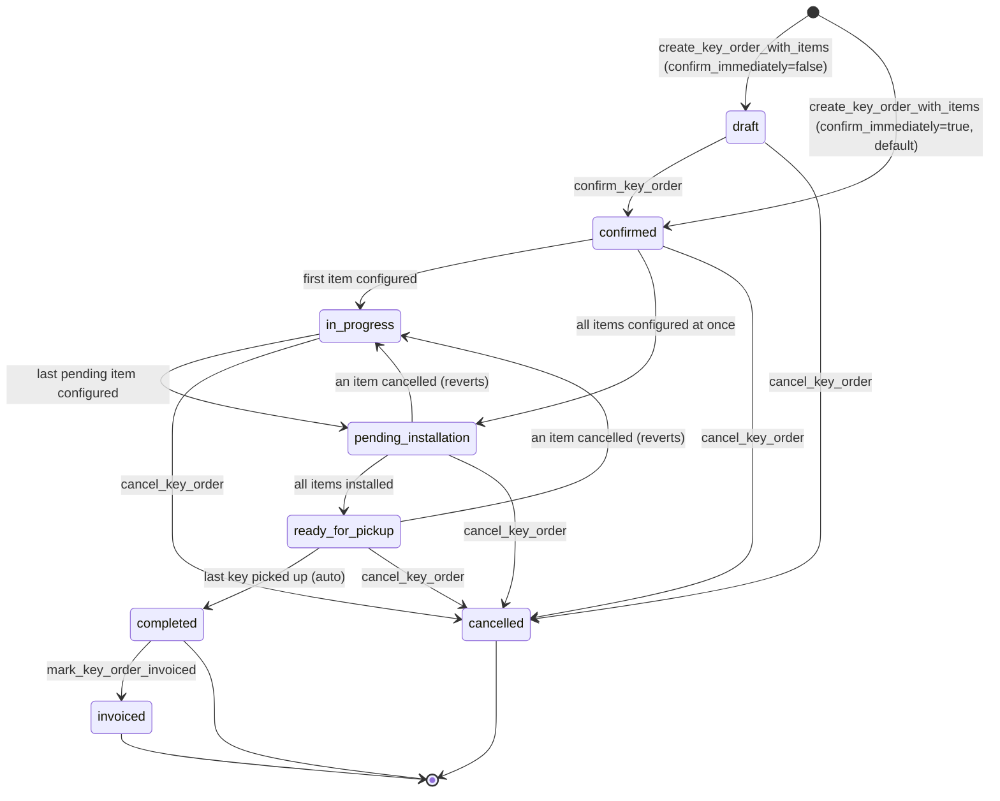

# Key Order — Full Lifecycle (draft → invoiced)

## Purpose

Defines the end-to-end journey of a **key order**: the business flow the
operator walks through to sell, configure, install, deliver, and invoice a
set of RFID keys tied to one or more units of a building. This is the
canonical happy-path plus the cancellation and error paths.

Key orders differ from technical orders in two key respects:

1. **They mint physical inventory** — every configured item creates a row in
   `public.rfid_keys` and drives the 5-state key lifecycle
   (see `openspec/specs/key-lifecycle/spec.md`).
2. **They do not create tickets.** All ticket-based work belongs to
   technical orders. Key orders drive their own state machine via the
   `recompute_key_order_status` trigger on `key_order_items.status`.

## Actors & preconditions

- **admin** (operator with `role='admin'` in `identity.staff`) — creates,
  confirms, edits, configures, cancels, marks invoiced.
- **installer** (staff with `role='installer'`) — currently uninvolved in
  the key-order flow itself; only involved through the linked equipment
  update tickets (see [[equipment-update]]).
- **system** — the trigger `key_order_items_recompute_order_status_trigger`
  advances `key_orders.status` automatically when item statuses change.
- **preconditions**:
  - Client exists: either an `administrations` row (client_type
    `administration`) or a `particulares` row (client_type `particular`).
  - Building exists under the administration (when client_type is
    administration).
  - Key product exists in `products` with `category='rfid_key'` and enough
    `stock_disponible` to cover the requested quantity.

## State machine

`key_orders.status` has **8 values** (CHECK constraint at
`supabase/migrations/20260823000097_key_orders_installation_stage.sql:32`).
`key_order_items.status` has **4 values** and drives the parent:

**Item state machine** (drives the parent via
`recompute_key_order_status`):

| item.status | Meaning | Reached via |
|---|---|---|
| `pending` | Line created, no RFID minted yet | `create_key_order_with_items` |
| `configured` | RFID minted, `produced_key_id` linked, stock consumed | `configure_key_order_item` |
| `installed` | Key physically installed at building reader | `mark_key_order_item_installed` |
| `cancelled` | Line cancelled (individually or by order cancellation) | `cancel_key_order` (cascade) |

**Parent transition rules** (from
`supabase/migrations/20260823000097_key_orders_installation_stage.sql:98`):

- `pending > 0` AND `(configured > 0 OR installed > 0)` → `in_progress`
- `pending > 0` AND nothing advanced → back to `confirmed`
- `pending = 0` AND `configured > 0` → `pending_installation`
- `pending = 0` AND `configured = 0` AND `installed > 0` → `ready_for_pickup`

Terminal states (`completed`, `invoiced`, `cancelled`) and `draft` never
auto-transition.

## Happy path

### Phase 1 — Draft / Creation

1. Admin navigates to `/llaves` → clicks **Nueva orden** →
   `apps/admin/src/routes/llaves/KeyOrdersPage.tsx` (list page).
2. Admin lands on `KeyOrderNuevaPage.tsx` which renders `KeyOrderForm`
   (`apps/admin/src/components/llaves/KeyOrderForm.tsx:161`).
3. Admin picks `client_type` (`administration` or `particular`), selects
   administration or particular, adds N key items with
   `product_id`, `building_id`, optional `unit_id`, `unit_price > 0`,
   optional `pickup_particular_id`.
4. Admin submits → `useMutateKeyOrder.create` mutation
   (`apps/admin/src/hooks/useMutateKeyOrder.ts:55`) → calls
   `createKeyOrderWithItems` in
   `packages/supabase/src/rpc/keyOrders.ts:69` → RPC
   `create_key_order_with_items(p_order, p_items, p_confirm_immediately=true)`
   (`supabase/migrations/20260818000086_rpc_create_key_order_with_items.sql:28`).
5. RPC validates client consistency, validates every item
   (`item_type='key'`, `building_id NOT NULL`, `unit_price > 0`,
   `quantity >= 1`), inserts the `key_orders` row with `status='draft'`,
   **explodes** every `quantity > N` item into N rows of `quantity=1` in
   `key_order_items` with `status='pending'`.
6. Because `p_confirm_immediately=true`, the RPC then calls
   `confirm_key_order` inline (see Phase 2).

### Phase 2 — Confirm & Stock Reservation

7. `confirm_key_order`
   (`supabase/migrations/20260818000086_rpc_create_key_order_with_items.sql:198`)
   row-locks the order, validates `status='draft'`, validates at least one
   non-cancelled item.
8. For every item with `product_id`, RPC INSERTs into
   `public.stock_movements` a row of
   `type='reserva'`, `quantity=-item.quantity`, `order_kind='key'`, linking
   `order_id` and `order_item_id`. Reservation is **idempotent** via a
   partial unique index on `(order_item_id, type) WHERE type='reserva'`.
9. RPC transitions `key_orders.status` → `'confirmed'`.
10. Admin sees the order in `KeyOrderDetailPage.tsx` with status badge
    "Confirmada" (`KeyOrderStatusBadge.tsx:6`).

### Phase 3 — Per-item Configuration (RFID minting + stock egress)

11. Admin opens each pending item in the detail page and clicks
    **Configurar**, opening `ConfigureKeyItemSheet.tsx`
    (`apps/admin/src/components/llaves/ConfigureKeyItemSheet.tsx`).
12. Admin scans/enters the RFID code, picks a unit under the item's
    building, optionally selects intended equipment(s), and submits.
13. Frontend calls `configureKeyOrderItem` in
    `packages/supabase/src/rpc/keyOrders.ts:124` → RPC
    `configure_key_order_item(p_order_item_id, p_rfid_code, p_unit_id, p_equipment_ids)`
    (`supabase/migrations/20260818000088_rpc_configure_key_order_item.sql:24`).
14. RPC (new-path branch, line 137+):
    - INSERTs `rfid_keys(rfid_code, unit_id, status='pending_creation')`.
    - INSERTs `key_events(event_type='creation_requested')`.
    - UPDATEs the item: `produced_key_id = <new key>`, `unit_id`,
      `status='configured'`.
    - INSERTs into `rfid_key_intended_equipment` for every equipment id.
    - Emits **two** `stock_movements`: one `egreso_grabacion` (definitive
      out) and one `liberacion_reserva` (releases the reservation from
      step 8). See [[stock-reservation]].
    - UPDATEs `rfid_keys.status` → `'pending_installation'`.
    - INSERTs `key_events(event_type='configured')`.
15. Trigger `key_order_items_recompute_order_status_trigger` fires →
    calls `recompute_key_order_status` → advances `key_orders.status` to
    `in_progress` (if some items still pending) or `pending_installation`
    (if all items now configured).

### Phase 4 — Physical Installation (bundle-driven)

16. Admin generates the per-equipment snapshot from `EquipoDetailPage`
    (`EquipmentKeySnapshotPanel`), uses the 3 groups (`to_activate`,
    `to_disable`, `unchanged`) in an external program to build the
    `.mdb`, then creates an `equipment_update` ticket per equipment
    with `keys_to_activate` and `keys_to_disable` populated and the
    `.mdb` uploaded.
17. Installer syncs the equipment and resolves the ticket. RPC
    `resolve_equipment_update`
    (`supabase/migrations/20260827000104_resolve_equipment_update_advance_key_order_items.sql`)
    does, in one transaction, per key in `keys_to_activate`:
    - Advances `rfid_keys.status` from `pending_installation` → `active`.
    - Mints `key_authorizations` with `sync_state='installed'`.
    - INSERTs `key_events(event_type='installed')`.
    - **UPDATEs `key_order_items.status` → `'installed'`** when the
      key is linked via `key_order_items.produced_key_id` (new-path).
    - Recompute trigger fires → parent advances to
      `ready_for_pickup` when all non-cancelled items are `installed`.

    An orphan `mark_key_order_item_installed` RPC
    (`supabase/migrations/20260823000097_key_orders_installation_stage.sql:153`)
    also exists but is no longer needed by the normal flow — the
    installer's resolve of `equipment_update` is the canonical entry
    point.

### Phase 5 — Pickup (Admin operator hands keys to end user)

17. When the parent is `ready_for_pickup`, admin opens the detail page
    and clicks **Registrar retiro** for a key → opens `PickupKeyDialog.tsx`
    (`apps/admin/src/components/llaves/PickupKeyDialog.tsx`).
18. Admin enters pickup person's name/surname/DNI (must match an
    authorized `pickup_particular_id` at item or order level for BOTH
    `particular` and `administration` client types).
19. Frontend calls RPC `record_order_key_pickup(p_key_id, name, surname,
    dni, actor_staff_id)`
    (`supabase/migrations/20260826000099_record_key_order_pickup_admin_flow.sql:23`).
20. RPC:
    - Locks the key and its owning order (via
      `key_order_items.produced_key_id`).
    - Requires `key_orders.status = 'ready_for_pickup'`.
    - UPDATEs `rfid_keys` setting `picked_up_by_*`, `picked_up_at=now()`,
      `delivered_by_staff_id`.
    - `rfid_keys_validate_pickup` trigger validates the DNI against
      authorized particulares — rejects unauthorized pickups.
    - **Auto-completes**: counts non-cancelled items where
      `rfid_keys.picked_up_at IS NOT NULL`. When it equals the total
      non-cancelled item count, UPDATEs the order to `status='completed'`.

### Phase 6 — Invoicing

21. Admin (or a downstream billing process) calls
    `mark_key_order_invoiced`
    (`supabase/migrations/20260818000087_rpc_key_order_lifecycle.sql:438`).
22. RPC requires `status='completed'`, transitions to `status='invoiced'`.
    Terminal state — no further transitions allowed.

## Cross-cutting effects

- **Stock reservation & egress** → `stock_movements` rows are the audit
  trail. `confirm_key_order` emits `reserva` (negative). `configure_key_order_item`
  emits `egreso_grabacion` (negative) + `liberacion_reserva` (positive
  offset to the reservation). `cancel_key_order` emits
  `liberacion_reserva` (positive) for every outstanding `reserva`. See
  [[stock-reservation]].
- **RFID key lifecycle** → mints `rfid_keys` in `pending_creation`, drives
  to `pending_installation` at configure, to `active` at install (see
  `openspec/specs/key-lifecycle/spec.md`).
- **`key_events` audit trail** → every state change on `rfid_keys` emits
  a row in `key_events`. Event types: `creation_requested`, `configured`,
  `installed`, `activated`, `deactivated`, `disable_requested`,
  `disable_cancelled`, `disabled`, `snapshot_skipped`
  (CHECK at `supabase/migrations/20260823000097_key_orders_installation_stage.sql:56`).
- **Cancellation cascade** → `key_orders_cancel_release_reservations`
  trigger
  (`supabase/migrations/20260818000087_rpc_key_order_lifecycle.sql:122`)
  fires on UPDATE to `status='cancelled'`: releases all outstanding
  reservations, cancels non-terminal items, and nullifies `order_item_id`
  on any minted-but-not-yet-active keys.

## Error paths & guards

| Trigger | Guard | Error / Effect |
|---|---|---|
| Missing `administration_id` when client_type=administration | Validation in `create_key_order_with_items` | `KEY_ORDER_CLIENT_INCONSISTENT` |
| Missing `particular_id`/DNI when client_type=particular | Validation | `KEY_ORDER_CLIENT_INCONSISTENT` |
| Item without `building_id` | Validation | `KEY_ORDER_MISSING_BUILDING` |
| Item with `unit_price <= 0` or null | Validation | `KEY_ORDER_PRICE_REQUIRED` |
| Empty items array | Validation | `KEY_ORDER_EMPTY` |
| `confirm_key_order` on non-draft | Status check | `KEY_ORDER_NOT_DRAFT` |
| `update_draft_key_order_with_items` on non-draft | Status check | `KEY_ORDER_NOT_DRAFT` |
| `update_draft_key_order_with_items` with stale `updated_at` | Optimistic concurrency | `KEY_ORDER_STALE` |
| `cancel_key_order` on terminal (completed/invoiced/cancelled) | Status check | `KEY_ORDER_TERMINAL_STATE` |
| `configure_key_order_item` on non-pending item | Status check | Raises with current status |
| `configure_key_order_item` on already-configured item | Idempotent | Returns existing `produced_key_id` |
| `mark_key_order_item_installed` on non-configured item | Status check | Raises with current status |
| `mark_key_order_item_installed` on already-installed | Idempotent no-op | Returns without change |
| `record_order_key_pickup` on order not in `ready_for_pickup` | Status check | Raises |
| `record_order_key_pickup` with unauthorized DNI | `rfid_keys_validate_pickup` trigger | Rejects |
| `mark_key_order_invoiced` on non-completed | Status check | `KEY_ORDER_NOT_COMPLETED` |
| Any admin RPC without admin role | RLS + RPC grants (`authenticated`) | Depends on RLS policy of touched tables |

## Known gaps

1. **`mark_key_order_item_installed` is now orphaned but still callable.**
   Migration `20260827000104_resolve_equipment_update_advance_key_order_items.sql`
   closed the original wiring gap by making `resolve_equipment_update`
   advance `key_order_items.status='installed'` automatically. The
   standalone RPC `mark_key_order_item_installed` is retained for
   backward compatibility with legacy callers but has NO UI wiring —
   the normal flow is now via `equipment_update` resolution. Consider
   dropping the RPC in a future cleanup if no legacy caller surfaces.

2. **Reservation on pre-existing reserva conflict.** The
   `ON CONFLICT DO NOTHING` clause in `confirm_key_order`
   (`supabase/migrations/20260818000086_rpc_create_key_order_with_items.sql:272`)
   assumes a partial unique index. Verify the index exists — if not, a
   re-confirmation on an unusual retry path could emit duplicate reservas.

## QA checklist

Manual regression steps a human (or Chrome DevTools MCP) can walk to
verify the flow end-to-end.

**Setup** (once per test run):
- [ ] Fresh test database with at least one administration, one building,
      one unit, one particular (as pickup authorization), and a `products`
      row of `category='rfid_key'` with `stock_disponible >= 3`.

**Happy path — administration client**:
- [ ] Login as admin → `/llaves` → click **Nueva orden**.
- [ ] Pick `client_type=administration`, select administration.
- [ ] Add 3 key items (all same product), assign a `pickup_particular_id`
      to at least one, set `unit_price=100`. Submit.
- [ ] Confirm order is created and lands on the detail page with status
      **Confirmada**.
- [ ] Verify DB: `key_orders.status='confirmed'`, three
      `key_order_items` rows with `status='pending'`, three
      `stock_movements` rows with `type='reserva'` and `quantity=-1` each.
- [ ] Configure item 1: pick unit, scan an RFID, submit. Confirm status
      badge changes to **En proceso** (`in_progress`).
- [ ] Verify DB: item 1 is `configured`, `rfid_keys` row created with
      `status='pending_installation'`, two new `stock_movements`
      (`egreso_grabacion` and `liberacion_reserva`),
      `rfid_key_intended_equipment` populated if equipment picked.
- [ ] Configure items 2 and 3 the same way. Confirm order transitions to
      **Pendiente instalación** (`pending_installation`).
- [ ] **Known gap** — no UI to advance to `ready_for_pickup`. Skip or
      manually run `select mark_key_order_item_installed(<item_id>);` for
      each item until the order reaches `ready_for_pickup`.
- [ ] Verify keys advance to `rfid_keys.status='active'` and
      `key_events` shows an `installed` event per key.
- [ ] Open the detail page in `ready_for_pickup`. Click **Registrar
      retiro** for a key. Enter authorized DNI. Confirm the key row
      shows `picked_up_at` and the badge stays `ready_for_pickup`.
- [ ] Register pickup for all remaining keys. Confirm the order
      transitions to **Completado** automatically.
- [ ] Trigger invoicing (currently manual RPC) → confirm status
      **Facturado** (`invoiced`).

**Cancellation path**:
- [ ] Create a new draft order, do not confirm. Cancel via
      `cancel_key_order`. Confirm: order → `cancelled`, all items →
      `cancelled`, no `liberacion_reserva` rows (there were no reservas).
- [ ] Create a confirmed order with configured items. Cancel it. Confirm:
      order → `cancelled`, items → `cancelled`, one
      `liberacion_reserva` per outstanding reserva, minted-but-not-active
      `rfid_keys` have their `order_item_id` nullified.

**Guards**:
- [ ] Try to submit an order with no items → toast shows
      `KEY_ORDER_EMPTY`.
- [ ] Try to submit an order with `unit_price=0` → toast shows
      `KEY_ORDER_PRICE_REQUIRED`.
- [ ] Try to register pickup with an unauthorized DNI → rejected by
      `rfid_keys_validate_pickup` trigger.

**RLS** (see [[rls-boundaries]]):
- [ ] Login as installer → should not see `/llaves` route at all.
- [ ] Login as installer, hit the `key_orders` REST endpoint directly →
      RLS should return empty.

## Related flows

- [[stock-reservation]] — reserva → egreso_grabacion → liberacion_reserva
  mechanics, exposed here at Phases 2, 3, and cancellation cascade.
- [[recompute-status]] — the trigger-driven state machine that governs
  parent status transitions.
- [[rls-boundaries]] — who can see and mutate what.
- [[billing-transitions]] — how `completed` reaches an invoice.
- [[equipment-update]] — the ticket that ALSO advances `rfid_keys` from
  `pending_installation` to `active` (parallel path — needs
  clarification, see Known gap #1).
