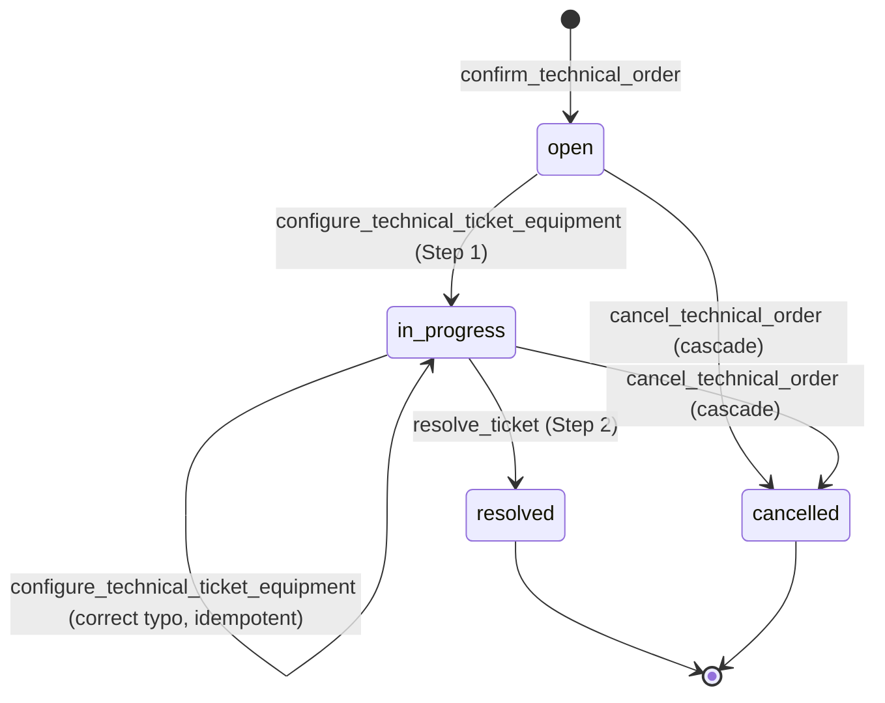

# Equipment Replacement Ticket — Two-Step Configure + Resolve

## Purpose

Swap out a failed or obsolete equipment for a new physical unit, keeping
**all previously active key authorizations** intact on the new device.
This is the flow that customers rely on when an RFID reader fails and
must be replaced without re-provisioning every tenant.

Uses the **two-step configure/resolve pattern** (introduced in commit
`c6aa02b`, 2026-08-26): the operator first tells the ticket which new
serial/model is arriving (Step 1), then finalizes at the physical
install (Step 2). The two-step flow allows the ticket to sit in
`in_progress` with a "pending new serial" so an admin can prepare
before dispatch.

## Actors & preconditions

- **admin** — creates the parent order with
  `item_type='equipment_replacement'`,
  `intended_equipment_id=<old>` (mandatory), `product_id=<new SKU>`
  (mandatory).
- **installer** — configures the new serial in the app and resolves
  when physically installed.
- **preconditions**:
  - Old equipment exists with `status='active'` (or at least not
    `dead`).
  - `product_id` on the item refers to the SKU of the replacement — for
    stock accounting.

## State machine

## Happy path

### Step 1 — Configure (operator prep, no physical side effects)

1. Ticket created by `confirm_technical_order` with
   `category='equipment_replacement'`,
   `equipment_id=<old_equipment_id>` (from
   `technical_order_items.intended_equipment_id`), `status='open'`.
2. Admin or installer opens the ticket UI (admin:
   `TareaDetailPage.tsx` → `ConfigureEquipmentPanel.tsx`; installer:
   `TicketCard.tsx` → `ConfigureEquipmentInline.tsx`).
3. Enters the new serial and (optional) model. Submits →
   `useConfigureTechnicalTicketEquipment` → RPC
   `configure_technical_ticket_equipment(p_ticket_id, p_new_serial,
   p_new_model?)`
   (`supabase/migrations/20260826000103_technical_ticket_two_step_configure_resolve.sql:162`).
4. RPC validates category is `equipment_installation` or
   `equipment_replacement`, status is `open`/`in_progress`.
5. RPC UPDATEs the ticket:
   `pending_new_serial=<trimmed>`,
   `pending_new_model=<caller's model OR product name from linked item>`.
6. Transitions `open → in_progress` (idempotent when already
   in_progress). No stock, no equipment, no authorizations mutated.

### Step 2 — Resolve (physical install)

7. Installer physically swaps the device on-site.
8. Taps **Marcar resuelta** → `useResolveTickets` → RPC `resolve_ticket`
   (`supabase/migrations/20260826000103_technical_ticket_two_step_configure_resolve.sql:293`).
9. RPC (equipment_replacement branch, ~line 425):
   - Locks the ticket, validates it is in `in_progress` with
     `pending_new_serial` set.
   - Calls
     `operations.replace_equipment(p_old_equipment_id, p_new_serial,
     p_new_model, p_new_description, ..., p_activate_keys_directly=true)`
     (`supabase/migrations/20260826000103_technical_ticket_two_step_configure_resolve.sql:76`).
10. `operations.replace_equipment` steps (all inside the same transaction):
    - Snapshots authorizations on the old equipment
      (`sync_state='installed'`) into a temp table (lines 110-116).
      **This is essential** because the next step's trigger closes
      those authorizations automatically.
    - UPDATEs the old equipment to `status='dead'` +
      `decommission_reason` — the
      `equipment_close_authorizations_on_dead` trigger fires and
      transitions the old authorizations out of `installed`.
    - INSERTs the new equipment with `status='active'` and
      `replaces_equipment_id=<old>` — audit trail preserved.
    - Re-creates authorizations on the new equipment from the snapshot
      (default `sync_state='pending_install'`, forced by
      `key_authorizations_validate`).
    - Because `p_activate_keys_directly=true`, promotes them from
      `pending_install → installed` atomically — meaning: the
      installer's DB transfer at install time is a **single call**;
      no separate "sync" step required. This matches the operator's
      mental model ("the installer transfers the DB at install time").
      See [[active-key-transfer]].
11. RPC then handles stock (same dual-FK-aware logic as
    [[equipment-installation-ticket]]): emits `egreso_reemplazo` +
    `liberacion_reserva` if the item had a `product_id`.
12. Ticket's `equipment_id` swapped to the new equipment id
    (via a transaction-scoped flag `app.allow_installer_equipment_swap`
    that bypasses the installer-column-restriction trigger — line 248).
13. Ticket transitions `in_progress → resolved`.

## Cross-cutting effects

- **Authorization transfer** — the whole point of this flow. See
  [[active-key-transfer]].
- **`operations.equipment.replaces_equipment_id`** provides the audit
  chain from new → old.
- **Stock**: `egreso_reemplazo` (negative) + `liberacion_reserva`
  (positive), fired only if `product_id` is set. See
  [[stock-reservation]].
- **Order recompute**: fires via `tickets_sync_order_status`.

## Error paths & guards

| Trigger | Guard | Effect |
|---|---|---|
| Configure with empty `p_new_serial` | Zero-length check | Raises |
| Configure a category that is not `equipment_installation`/`equipment_replacement` | Category check | Raises |
| Configure a ticket in `resolved`/`cancelled` | Status check | Raises |
| Resolve without a preceding configure (missing `pending_new_serial`) | Guard in resolve branch | Raises (verify current message) |
| Old equipment already `dead` | `replace_equipment` check line 103 | Raises `equipment already dead` |
| Installer resolves a ticket assigned to someone else | RLS | Rejected |

## Known gaps

None spotted in the two-step flow. It was added yesterday
(`c6aa02b`) to close a real gap where the previous single-step resolve
required admin permissions.

## QA checklist

- [ ] Setup: administration + building + old equipment with 3 active
      key authorizations installed.
- [ ] Admin creates a technical order with 1
      `equipment_replacement` item: `intended_equipment_id=<old>`,
      `product_id=<sku>`, `intended_assignee_staff_id=<installer>`.
      Confirm → verify ticket exists, `pending_new_serial` NULL.
- [ ] Installer opens the ticket → enters new serial `NEW-42` +
      model `V2` → submit → verify ticket `status='in_progress'` and
      `pending_new_serial='NEW-42'`.
- [ ] Installer taps **Resolver** → verify:
  - Old `operations.equipment` → `status='dead'`,
    `decommission_reason` set.
  - New `operations.equipment` row exists with `serial='NEW-42'`,
    `status='active'`, `replaces_equipment_id=<old>`.
  - 3 new `operations.key_authorizations` rows on the new equipment,
    all `sync_state='installed'`, `installed_by_staff_id=<installer>`.
  - Ticket `status='resolved'`, `equipment_id=<new>`.
  - `stock_movements` has `egreso_reemplazo` + `liberacion_reserva`.
- [ ] Retry configure Step 1 on the same ticket (typo scenario) →
      idempotent, still in_progress with updated `pending_new_serial`.
- [ ] Try to resolve without configuring first → RPC rejects.

## Related flows

- [[technical-order-lifecycle]] — parent.
- [[equipment-installation-ticket]] — the sibling that creates NEW
  equipment (no swap).
- [[equipment-update-ticket]] — the specialized flow for updating
  keys on an existing (not replaced) equipment.
- [[active-key-transfer]] — the transfer mechanics.
- [[stock-reservation]] — accounting.
