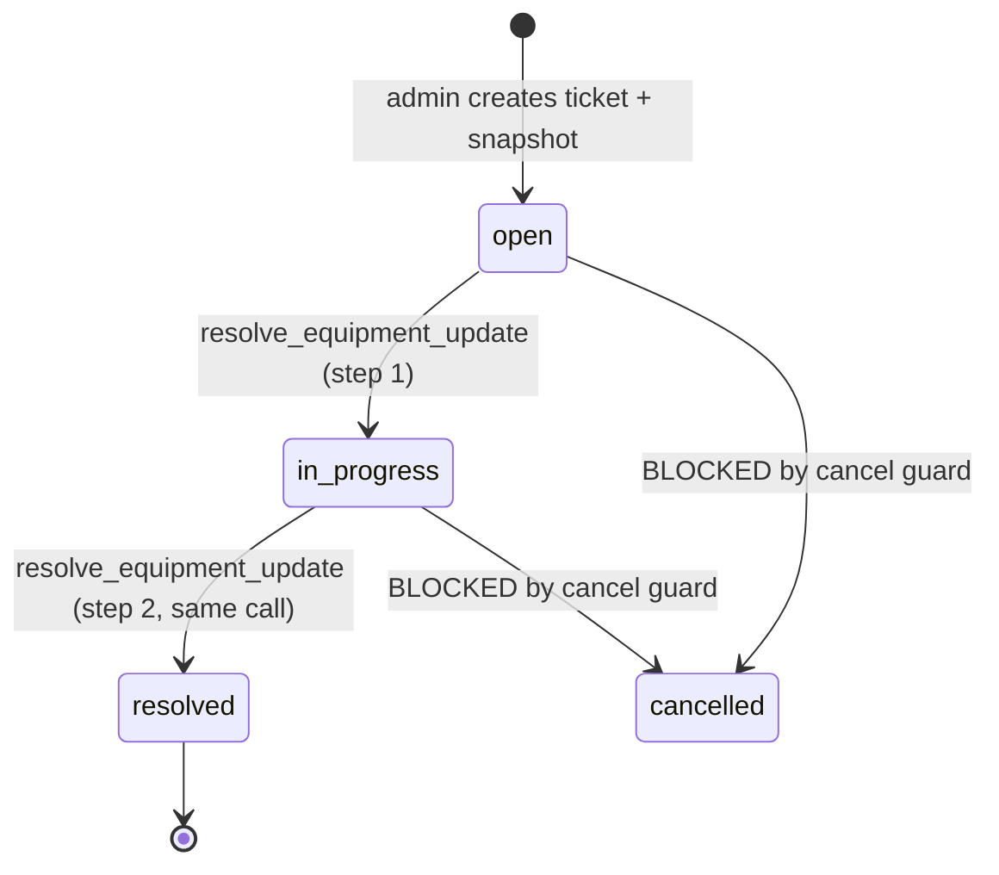

# Equipment Update Ticket — MDB Snapshot + Key Batch Toggle

## Purpose

An `equipment_update` is the mechanism by which the installer's field
device syncs its local key database (an `.mdb` file) with an existing
equipment. The ticket carries a **snapshot** of two disjoint sets:

- `keys_to_activate` — RFID keys that should transition to `active`
  and be marked `installed` on the equipment.
- `keys_to_disable` — RFID keys that should transition to `disabled`
  and have their `key_authorizations` marked `removed`.

Plus a Supabase Storage reference (`mdb_storage_path`) pointing to the
`.mdb` file uploaded when the ticket was created.

The equipment_update is the primary way `rfid_keys.status` advances
from `pending_installation → active` today (see Known gap #1 of
[[key-order-lifecycle]] and [[key-installation-ticket]]).

## Actors & preconditions

- **admin** — creates the ticket via
  `EquipmentUpdateFormSheet.tsx`, picking the equipment and the two
  key sets, uploading the `.mdb`. The upload lands in the private
  `equipment_updates` storage bucket
  (`supabase/migrations/20260818000071_storage_bucket_equipment_updates.sql`).
- **installer** — resolves the ticket by tapping **Actualizar equipo**
  in the app. The installer downloads the `.mdb`, syncs the device,
  then confirms → single RPC call finalizes everything server-side.
- **preconditions**:
  - Equipment exists with `status='active'`.
  - Keys in `keys_to_activate` are `rfid_keys.status='pending_installation'`.
  - Keys in `keys_to_disable` are `rfid_keys.status='pending_disable'`.

## State machine

**Cancellation is blocked**: migration `000067` installs a BEFORE
UPDATE trigger that rejects `in_progress → cancelled` for
`equipment_update` category
(`supabase/migrations/20260818000067_tickets_equipment_update_category.sql:8`).
This exists because a partially-applied `.mdb` sync can leave the
device out of sync with the DB — cancellation would create an
irreversible drift.

## Happy path

### Phase 1 — Creation

1. Admin opens equipment detail → `EquipmentUpdatePanel.tsx` → clicks
   **Nueva actualización** → `EquipmentUpdateFormSheet.tsx`.
2. Selects which pending-installation keys go into `keys_to_activate`
   and which pending-disable keys go into `keys_to_disable`. Uploads
   the `.mdb` file.
3. Backend flow (server-side, admin-only):
   - Insert into `support.equipment_updates` with the snapshot arrays
     and `mdb_storage_path`.
   - Insert into `support.tickets` with
     `category='equipment_update'`, `status='open'`,
     `assigned_to_staff_id=<installer>`, `equipment_id=<eq>`.

### Phase 2 — Installer resolves (single atomic call)

4. Installer opens the ticket → sees the snapshot summary + a link to
   download the `.mdb` (RLS-scoped via storage policy
   `installer_read_assigned_equipment_updates_mdb`).
5. Installer performs the physical device sync. Once done, taps
   **Confirmar actualización** → `useResolveEquipmentUpdate` → RPC
   `resolve_equipment_update(p_task_id, p_actor_staff_id?)`
   (`supabase/migrations/20260818000072_resolve_equipment_update_v2_return.sql:15`).
6. RPC steps (single transaction, atomic — line 15+):
   - Locks the `equipment_updates` task and reads the snapshot.
   - Locks the ticket and validates it is
     `category='equipment_update'` and not resolved.
   - Transitions ticket `open → in_progress` (idempotent).
   - **For each key in `keys_to_activate`** (line 83):
     - Locks the key. If `status='pending_installation'`:
       - Advances to `active`.
       - INSERTs a `key_authorizations(sync_state='pending_install')`
         via trigger default.
       - Immediately UPDATES to `sync_state='installed'` (line 104).
       - Emits `key_events(event_type='activated')`.
       - If the key has a legacy `order_item_id`, calls
         `recompute_order_status` (line 116).
     - If not `pending_installation` (stale snapshot):
       collects the key in `skipped_key_ids` and emits
       `key_events(event_type='snapshot_skipped')`. Does NOT abort.
   - **For each key in `keys_to_disable`** (line 132):
     - Locks the key. If `status='pending_disable'`:
       - Advances to `disabled`.
       - UPDATEs `key_authorizations` on this equipment via
         `installed → pending_removal → removed`.
       - Emits `key_events(event_type='disabled')`.
     - Otherwise skipped and logged.
   - Transitions ticket `in_progress → resolved`.
   - UPDATEs `equipment_updates.resolved_at`, `resolved_by_staff_id`.
7. RPC returns
   `{"ticket_id": <uuid>, "skipped_key_ids": [<uuid>, ...]}` — the
   caller surfaces which keys were skipped so the operator can
   investigate the drift.

## Cross-cutting effects

- **This IS the primary key-activation path**. If you want to
  activate a batch of programmed keys, create an
  `equipment_update` — there is no single-key "install" UI today
  (Known gap #1 in [[key-order-lifecycle]]).
- **Realtime snapshot fetch**: installer app fetches the snapshot
  arrays for each assigned `equipment_update` ticket in a batched
  query (`useAssignedTickets.ts:127`) so the UI can render before
  install.
- **Snapshot skip is non-fatal**: the RPC's design choice is to
  **not** abort on stale keys — it processes what it can and
  reports the skipped ids. This is deliberate: an installer in the
  field cannot afford a hard failure that requires round-tripping
  to an admin.

## Error paths & guards

| Trigger | Guard | Effect |
|---|---|---|
| Task not found | Existence check | Raises `task % not found` |
| Ticket category is not `equipment_update` | Category check | Raises |
| Ticket already `resolved` | Idempotent guard | Raises `already resolved` |
| Ticket in unexpected status (not open/in_progress) | Status check | Raises |
| Snapshot key not in expected precursor status | Non-fatal — collected in `skipped_key_ids` | Emits `snapshot_skipped` event, RPC continues |
| Cancel attempt on in_progress | `cancel_equipment_update` guard trigger | Rejected |
| Non-assigned installer | Storage bucket + RPC RLS | Cannot read MDB or resolve |
| Missing `mdb_storage_path` at creation | (verify at INSERT) | Should be enforced by app; DB does not enforce |

## Known gaps

1. **`snapshot_skipped` events proliferate silently**. If snapshots
   are stale often, the `key_events` table fills with noise. Consider
   adding a dashboard alert when skipped counts exceed a threshold.

## Resolved gaps (post equipment-update-bundle-flow)

- **New-path `key_order_items` advancement**: Migration
  `20260827000104_resolve_equipment_update_advance_key_order_items.sql`
  added a parallel branch that reads `key_order_items` via
  `produced_key_id` and UPDATEs `status='installed'`. The 4-lane
  recompute trigger then advances the parent `key_order`. The legacy
  `recompute_order_status` path is preserved unchanged for backward
  compat with pre-refactor keys.

## QA checklist

- [ ] Setup: 1 equipment, 3 keys in `pending_installation`, 1 key in
      `pending_disable`.
- [ ] Admin creates an equipment_update: `keys_to_activate=[3 keys]`,
      `keys_to_disable=[1 key]`, upload MDB. Verify:
  - `support.equipment_updates` row created.
  - `support.tickets` row `category='equipment_update'`,
    `status='open'`.
  - MDB file present in `equipment_updates` bucket.
- [ ] Installer opens ticket → sees snapshot summary, downloads MDB.
- [ ] Installer resolves → verify:
  - 3 keys → `status='active'`.
  - 3 new `key_authorizations` rows,
    `sync_state='installed'`.
  - 1 key → `status='disabled'`, its authorization → `removed`.
  - 4 `key_events` rows (3 `activated` + 1 `disabled`).
  - Ticket `status='resolved'`.
  - `equipment_updates.resolved_at` and `resolved_by_staff_id`
    populated.
  - RPC returns `{ticket_id, skipped_key_ids: []}`.
- [ ] Snapshot drift: manually flip one of the pending_installation
      keys to `disabled` BEFORE resolving. Resolve → verify:
  - That key remains `disabled`.
  - `snapshot_skipped` event emitted for it.
  - `skipped_key_ids` in RPC return contains this key.
  - Other keys still process normally.
- [ ] Try to cancel a ticket in `in_progress` → rejected by trigger.

## Related flows

- [[technical-order-lifecycle]] — NOT the parent for this ticket type
  (equipment_update tickets are NOT created by
  `confirm_technical_order` — they are created via a separate admin
  flow when an equipment is opened).
- [[active-key-transfer]] — related mechanics for
  `equipment_replacement`.
- [[key-order-lifecycle]] — the main producer of
  `pending_installation` keys that this ticket consumes.
