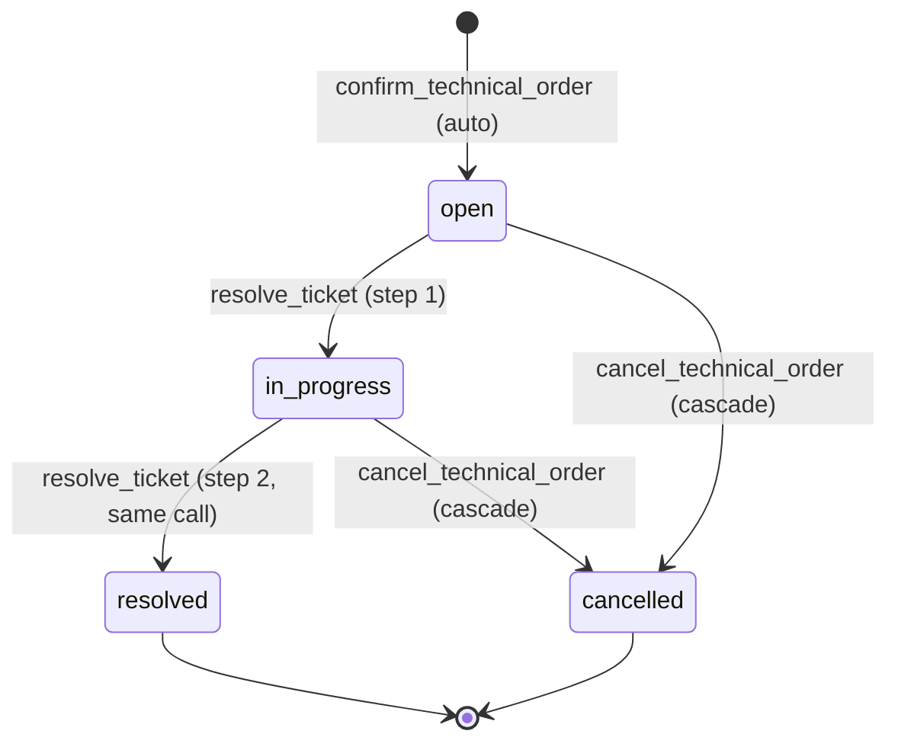

# Maintenance Ticket — Resolution Flow

## Purpose

`support.tickets.category = 'maintenance'` covers generic upkeep work on
an already-installed equipment: cleaning, calibration, inspection, minor
repairs. Unlike replacement or installation, it does NOT change equipment
identity, does NOT mint keys, does NOT touch stock.

## Actors & preconditions

- **admin** — creates the parent technical order (see
  [[technical-order-lifecycle]]) which auto-generates this ticket at
  confirm time.
- **installer** — receives the assigned ticket via
  `useAssignedTickets` and resolves it in the installer app.
- **preconditions**:
  - `technical_order_items.intended_equipment_id` is set at order
    creation. The `confirm_technical_order` RPC requires it for
    `maintenance` items.
  - `intended_assignee_staff_id` set at order creation.

## State machine

`support.tickets.status` is `open`/`in_progress`/`resolved`/`cancelled`.
Direct `open → resolved` UPDATEs are **rejected** by
`support.tickets_validate` — the transition must go through
`in_progress`. That is why `resolve_ticket` (below) does it in two
steps inside one transaction.

## Happy path

1. Ticket is created by `confirm_technical_order` with
   `category='maintenance'`, `status='open'`,
   `assigned_to_staff_id=<installer>`,
   `equipment_id=<intended_equipment_id>`,
   `technical_order_item_id=<item>` (see
   [[technical-order-lifecycle]] Phase 2).
2. Installer opens the app → `useAssignedTickets` shows the ticket
   (`apps/installer/src/hooks/useAssignedTickets.ts:224`).
3. Installer works in the field, then in the app taps **Marcar
   resuelta** on the ticket → `useResolveTickets`
   (`apps/installer/src/hooks/useResolveTickets.ts:13`) →
   RPC `resolve_ticket(p_ticket_id, p_note, p_actor_staff_id?)`
   (`supabase/migrations/20260826000103_technical_ticket_two_step_configure_resolve.sql:293`).
4. RPC executes the state-machine two-step transition atomically:
   - `UPDATE ... SET status='in_progress' WHERE status='open'`
   - `UPDATE ... SET status='resolved', resolved_by_staff_id, resolution_notes WHERE status='in_progress'`
5. The `tickets_require_equipment_on_resolve` trigger
   (`supabase/migrations/20260811000052_equipment_assignment_on_tickets.sql:213`)
   REJECTS the resolve if `equipment_id IS NULL`. For maintenance
   tickets this is always satisfied because the RPC required it at
   confirm.
6. `tickets_sync_order_status` trigger fires → advances the parent
   technical order via `recompute_technical_order_status` (see
   [[recompute-status]]).

## Cross-cutting effects

- **No stock movement**. Maintenance tickets do not carry an
  `intended_product_id`; no `reserva` was ever created for them.
- **Realtime**: installer subscribes to their `assigned_to_staff_id`
  channel; ticket status changes trigger cache invalidation. See
  [[realtime-channels]].
- **Parent order advances** when this is the last non-resolved ticket
  of the order.

## Error paths & guards

| Trigger | Guard | Effect |
|---|---|---|
| Resolve without `equipment_id` | `tickets_require_equipment_on_resolve` trigger | Raises `check_violation` |
| Direct `open → resolved` UPDATE | `support.tickets_validate` | Raises |
| Resolve an already-`resolved` ticket | Idempotent-guard inside `resolve_ticket` | RPC no-op OR raises depending on version |
| Non-installer caller | RLS on `support.tickets` | Query returns empty; RPC rejected |
| Installer resolves a ticket not assigned to them | RLS `assigned_to_staff_id = auth.uid()` | Rejected |

## Known gaps

None specific to maintenance. All flow-level gaps live in
[[technical-order-lifecycle]].

## QA checklist

- [ ] Login as admin → create a technical order with 1 maintenance item
      (intended equipment + intended assignee) → confirm → verify one
      `support.tickets` row with `category='maintenance'`,
      `status='open'`, `equipment_id` set.
- [ ] Login as installer → home → see the ticket → tap **Marcar
      resuelta** with a note → confirm ticket goes
      `open → in_progress → resolved` in a single mutation.
- [ ] Verify parent technical order transitions
      `confirmed → in_progress → completed` via
      `recompute_technical_order_status`.
- [ ] Try to resolve a ticket assigned to a different installer → RLS
      returns empty on read; RPC would reject anyway.

## Related flows

- [[technical-order-lifecycle]] — the parent flow that generates this
  ticket.
- [[recompute-status]] — how ticket status drives the order.
- [[realtime-channels]] — how the installer sees the ticket in real time.
