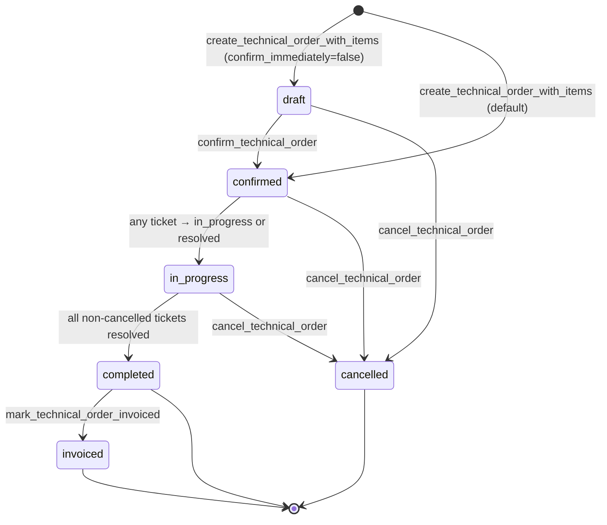

# Technical Order — Full Lifecycle (draft → invoiced)

## Purpose

A **technical order** groups one or more physical/service work items into
a single billable unit. Unlike key orders, technical orders exist to
generate **tickets** — the tickets are the units of work the installer
executes.

The key distinction from `[[key-order-lifecycle]]`:

| Aspect | Key order | Technical order |
|---|---|---|
| Mints inventory | RFID keys | No (equipment already exists) |
| Generates tickets | No | **Yes** — one per item on confirm |
| Item types | `key` only | `equipment`, `maintenance`, `installation`, `equipment_replacement` |
| Status count | 8 | 6 |
| Item explosion | quantity → N rows | 1 row per line, `quantity` preserved |
| Driven by | `key_order_items.status` | `support.tickets.status` |

## Actors & preconditions

- **admin** — creates, confirms, edits (draft only), cancels, marks
  invoiced.
- **installer** — resolves the linked tickets (see the per-ticket flow
  docs).
- **system** — the trigger `tickets_sync_order_status` fires on every
  ticket status change and calls `recompute_technical_order_status`.
- **preconditions**:
  - Client exists (administration or particular).
  - For `maintenance` and `equipment_replacement` items: an
    `operations.equipment` row exists and links to a `building`.
  - For `equipment` items: a `products` row of the right category exists
    with stock.
  - Installer(s) are registered in `identity.staff` and appear in the
    intended assignee picker.

## State machine

`technical_orders.status` — **6 values**
(`TechnicalOrderStatusBadge.tsx:5`):

**Important**: technical orders have **no `ready_for_pickup` state**
(there is nothing physical to pick up — the installer completes work in
the field). The status labels are:

| Status | Spanish label | Tone |
|---|---|---|
| `draft` | Borrador | neutral |
| `confirmed` | Confirmada | brand |
| `in_progress` | En proceso | warning |
| `completed` | **Lista para facturar** | success |
| `invoiced` | Facturado | neutral |
| `cancelled` | Cancelado | danger |

## Happy path

### Phase 1 — Draft / Creation

1. Admin lands on `/servicio-tecnico` →
   `apps/admin/src/routes/servicio-tecnico/TechnicalOrdersPage.tsx`.
2. Clicks **Nueva orden** → `TechnicalOrderNuevaPage.tsx` → renders
   `TechnicalOrderForm`.
3. Admin picks `client_type`, administration OR particular, then adds
   items. Every item must specify:
   - `item_type` (one of the 4 domain values)
   - `quantity`, `unit_price > 0`, optional `description`, `building_id`
   - `intended_assignee_staff_id` — required to confirm
   - `intended_equipment_id` — required for `maintenance` and
     `equipment_replacement`
   - `intended_replacement_equipment_id` — only for
     `equipment_replacement`
   - `product_id` — required for `equipment` items (the SKU to install)
4. Submits → `useMutateTechnicalOrder.create` → RPC
   `create_technical_order_with_items(p_order, p_items,
   p_confirm_immediately=true)`
   (`supabase/migrations/20260818000089_rpc_create_technical_order_with_items.sql:41`).
5. RPC validates client consistency, per-item validation
   (`item_type in ('equipment', 'maintenance', 'installation',
   'equipment_replacement')`, `unit_price > 0`, `quantity >= 1`,
   confirm-time intent validation if `p_confirm_immediately=true`).
6. Inserts `technical_orders(status='draft')` and one
   `technical_order_items(status='pending')` per item (NOTE: technical
   orders **do NOT explode** `quantity` — a line with `quantity=3` is
   one item with 3 units).
7. Because `p_confirm_immediately=true`, RPC calls
   `confirm_technical_order` inline.

### Phase 2 — Confirm (Ticket generation + Stock reservation)

8. `confirm_technical_order`
   (`supabase/migrations/20260818000089_rpc_create_technical_order_with_items.sql:221`)
   row-locks the order, validates `status='draft'`, validates every
   non-cancelled item has `intended_assignee_staff_id`, validates
   `intended_equipment_id` for `maintenance` and
   `equipment_replacement`.
9. **Advances `technical_orders.status` to `'confirmed'` BEFORE
   creating tickets** (line 291). This is intentional — the
   `intent_immutable` trigger fires on any subsequent item UPDATE, and
   the order must not be in `draft` at that point.
10. For each non-cancelled item, RPC (line 296):
    - **Derives `building_id` and `administration_id`** from the
      intended equipment via `operations.equipment → buildings`
      (line 317).
    - **Maps `item_type` → `ticket.category`**:
      | item_type | ticket.category |
      |---|---|
      | `installation` | `installation` |
      | `equipment_replacement` | `equipment_replacement` |
      | `maintenance` | `maintenance` |
      | `equipment` | `equipment_installation` |
    - **INSERTs one `support.tickets` row** with `status='open'`,
      `assigned_to_staff_id=intended_assignee_staff_id`,
      `technical_order_item_id=<this item's id>`. Skipped if
      `building_id` or `administration_id` cannot be derived (e.g.
      installation with no intended_equipment).
    - **If `product_id IS NOT NULL`**: INSERTs a `stock_movements`
      row of `type='reserva'`, `quantity=-item.quantity`,
      `order_kind='technical'`.

### Phase 3 — Installer resolves tickets

11. Installer sees the tickets in `/` (installer home) via
    `useAssignedTickets` (see [[realtime-channels]]).
12. Installer opens each ticket and works through its per-category
    flow. See the corresponding doc: [[maintenance-ticket]],
    [[installation-ticket]], [[equipment-installation-ticket]],
    [[equipment-replacement-ticket]], [[equipment-update-ticket]].
13. Each ticket resolution transitions `support.tickets.status`:
    `open → in_progress → resolved`.

### Phase 4 — Trigger-driven status recompute

14. **Every** `support.tickets` UPDATE fires
    `tickets_sync_order_status`
    (`supabase/migrations/20260818000090_rpc_technical_order_lifecycle.sql:98`),
    which calls `recompute_technical_order_status(order_id)`.
15. `recompute_technical_order_status` reads the ticket counts:
    - If **all** non-cancelled tickets are `resolved` →
      `technical_orders.status = 'completed'`.
    - If **any** ticket is `in_progress` or `resolved` (but not all
      resolved) → `status = 'in_progress'`.
    - Otherwise no transition.

### Phase 5 — Invoicing

16. Admin (or a downstream billing process) calls
    `mark_technical_order_invoiced` → advances `completed` →
    `invoiced`. Terminal state.

## Cross-cutting effects

- **Ticket generation is the whole point** — an item without a ticket
  is effectively dead (no way to advance). See the ticket-creation gap:
  if an `installation` item has no `intended_equipment_id`, no ticket
  is created. Verify this in the UI (it should be prevented).
- **Stock reservation** → same mechanism as [[key-order-lifecycle]] but
  with `order_kind='technical'`. Downstream ticket resolution RPCs
  (`resolve_equipment_installation`, `resolve_equipment_replacement`)
  are the ones that emit the definitive `egreso_instalacion` and
  `egreso_reemplazo` movements. See [[stock-reservation]].
- **Intent immutability** — once confirmed, item fields
  (`intended_equipment_id`, `intended_assignee_staff_id`, `product_id`,
  `intended_replacement_equipment_id`) are immutable via the
  `intent_immutable` trigger. Editing requires cancelling and
  recreating.
- **Cancellation cascade** — cancelling the order fires
  `technical_orders_cancel_release_reservations`, which cancels all
  linked tickets, releases reserved stock, and marks items cancelled.

## Error paths & guards

| Trigger | Guard | Error / Effect |
|---|---|---|
| Missing `administration_id`/`particular_id` | Client validation | `TECHNICAL_ORDER_CLIENT_INCONSISTENT` |
| Invalid `item_type` | Validation | `TECHNICAL_ORDER_INVALID_ITEM_TYPE` |
| `unit_price <= 0` | Validation | `TECHNICAL_ORDER_PRICE_REQUIRED` |
| `quantity < 1` | Validation | `TECHNICAL_ORDER_INVALID_QUANTITY` |
| Confirm without `intended_assignee_staff_id` | Confirm-time check | `TECHNICAL_ORDER_INTENT_REQUIRED` |
| Confirm without `intended_equipment_id` on `maintenance`/`equipment_replacement` | Confirm-time check | `TECHNICAL_ORDER_INTENT_REQUIRED` |
| Confirm without `product_id` on `equipment` | Confirm-time check | `TECHNICAL_ORDER_PRODUCT_REQUIRED` |
| Confirm on non-draft | Status check | `TECHNICAL_ORDER_NOT_DRAFT` |
| Update draft on non-draft | Status check | `TECHNICAL_ORDER_NOT_DRAFT` |
| Update with stale `updated_at` | Optimistic concurrency | `TECHNICAL_ORDER_STALE` |
| Edit item intent post-confirm | `intent_immutable` trigger | Raises |
| Cancel on terminal | Status check | `TECHNICAL_ORDER_TERMINAL_STATE` |
| Invoice on non-completed | Status check | `TECHNICAL_ORDER_NOT_COMPLETED` |

## Known gaps

1. **Installation items with no intended_equipment_id silently do not
   create a ticket.** The RPC skips ticket creation when
   `building_id`/`admin_id` cannot be derived
   (`create_technical_order_with_items:327`). If the UI ever lets an
   installation item through without an intended equipment, the item
   will exist without a ticket and the order will never leave
   `confirmed`. Verify UI form validation.
2. **The `equipment_update` category is generated by a different
   path**, not by `confirm_technical_order`. See
   [[equipment-update-ticket]].

## QA checklist

- [ ] Login as admin → `/servicio-tecnico` → **Nueva orden** → pick
      administration → add 1 `maintenance` item (intended equipment +
      intended assignee) + 1 `installation` item (intended assignee
      only) + 1 `equipment` item (product + intended assignee) → submit.
- [ ] Verify DB: `technical_orders.status='confirmed'`, 3
      `technical_order_items` rows, 2 `support.tickets` rows
      (categories `maintenance` and `equipment_installation`; the
      installation item may lack a ticket if intended_equipment_id is
      null — Known gap #1), 1 `stock_movements` `reserva` for the
      equipment item.
- [ ] Move the maintenance ticket to `in_progress` (as installer) →
      confirm order transitions to **En proceso**.
- [ ] Resolve all tickets → confirm order transitions to **Lista para
      facturar** (`completed`).
- [ ] Call `mark_technical_order_invoiced` → confirm **Facturado**.
- [ ] Try to edit an item intent post-confirm → rejected by
      `intent_immutable`.
- [ ] Cancel a confirmed order → verify: order → `cancelled`, all
      linked tickets → `cancelled`, all reserved stock released
      (`liberacion_reserva` rows).

## Related flows

- [[key-order-lifecycle]] — the sibling flow for key orders.
- [[maintenance-ticket]], [[installation-ticket]],
  [[equipment-installation-ticket]], [[equipment-replacement-ticket]],
  [[equipment-update-ticket]] — per-category resolution flows.
- [[recompute-status]] — the trigger-driven state machine mechanics.
- [[stock-reservation]] — `reserva`/`egreso_*` accounting.
- [[order-numbering]] — how `order_number` is generated.
- [[billing-transitions]] — `completed → invoiced`.
